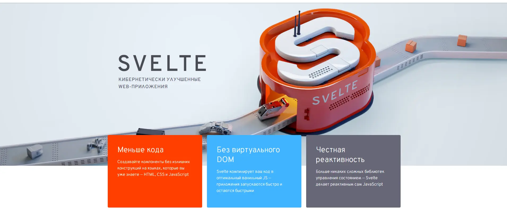

||
|--|

# Русская документация Svelte

(доступна также [русская документация SvelteKit](http://svelte-kit.ru/))

Svelte — это принципиально новый подход к созданию пользовательских интерфейсов. Когда традиционные фреймворки, такие как React и Vue, выполняют основную часть своей работы в браузере, Svelte переносит эту работу на этап компиляции, который происходит при сборке приложения.

Вместо использования таких тяжелых приёмов, как сравнение состояний виртуального DOM, Svelte пишет код, который точечно обновляет DOM при изменении состояния вашего приложения.

Мы гордимся тем, что Svelte был признан самым [любимым web-фреймворком](https://insights.stackoverflow.com/survey/2021#section-most-loved-dreaded-and-wanted-web-frameworks) и [наиболее удовлетворившим](https://2020.stateofjs.com/en-US/technologies/front-end-frameworks/) в паре широких опросов разработчиков. Думаем, вы тоже полюбите его. [Прочтите вводную статью в блоге](/blog/2019-04-22-svelte-3-rethinking-reactivity), чтобы узнать больше.

---

> Оригинал перевода тут [https://github.com/AlexxNB/svelte3-translation-ru](https://github.com/AlexxNB/svelte3-translation-ru)
и тут [https://github.com/sveltejs-translations](https://github.com/sveltejs-translations)

---

**TODO:**
- [ ] Обновить перевод документации до текущей версии (актуализировать)
    - [x] добавить раздел "Начало работы"
    - [ ] обновить раздел "Предупреждения a11y"
- [ ] Добавить переводы отсутствующих статей блога
- [ ] Исправить внутренние и внешние ссылки
    - [x] в документации
    - [ ] в блоге

---
||
|--|
|[Работает на docsify](https://docsify.js.org)|
